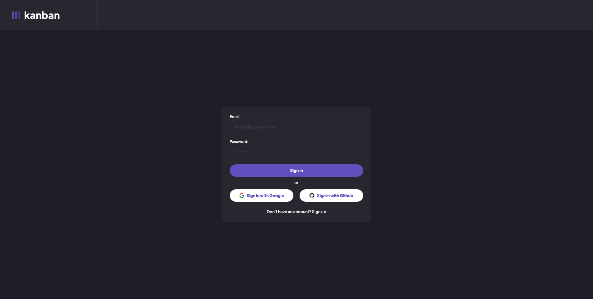
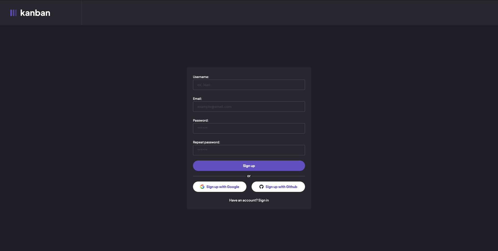
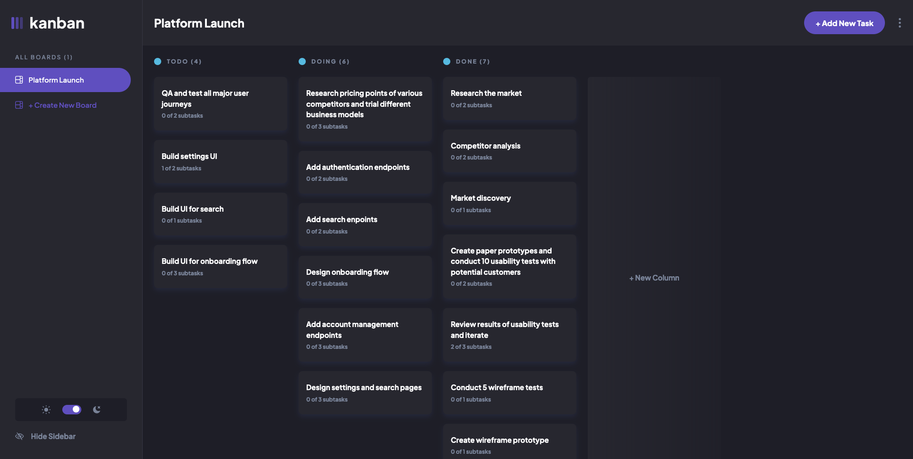
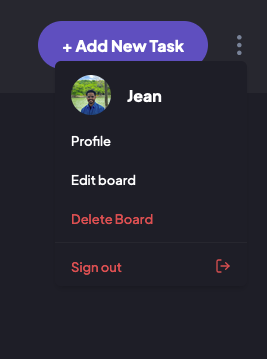
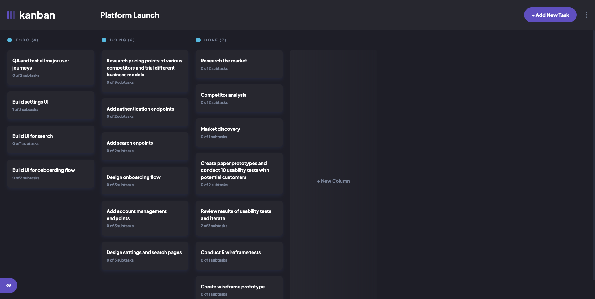
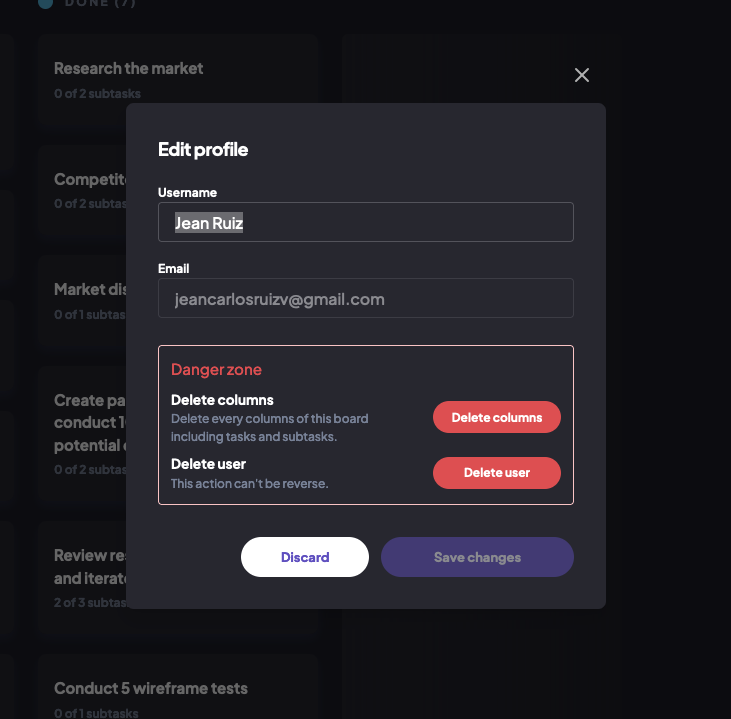
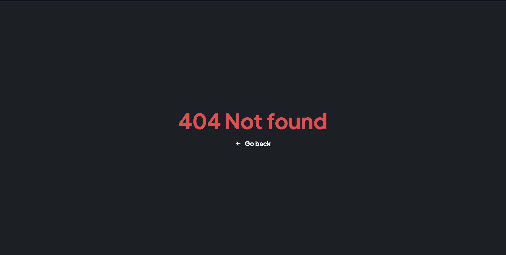

# Frontend Mentor - Kanban task management web app solution

This is a solution to the [Kanban task management web app challenge on Frontend Mentor](https://www.frontendmentor.io/challenges/kanban-task-management-web-app-wgQLt-HlbB). Frontend Mentor challenges help you improve your coding skills by building realistic projects.

## Table of contents

- [Overview](#overview)
  - [The challenge](#the-challenge)
  - [Screenshot](#screenshot)
  - [Links](#links)
- [My process](#my-process)
  - [Built with](#built-with)
  - [What I learned](#what-i-learned)
  - [Useful resources](#useful-resources)
- [Author](#author)

## Overview

### The challenge

Users should be able to:

- View the optimal layout for the app depending on their device's screen size
- See hover states for all interactive elements on the page
- Create, read, update, and delete boards and tasks
- Receive form validations when trying to create/edit boards and tasks
- Mark subtasks as complete and move tasks between columns
- Hide/show the board sidebar
- Toggle the theme between light/dark modes
- **Bonus**: Allow users to drag and drop tasks to change their status and re-order them in a column
- **Bonus**: Keep track of any changes, even after refreshing the browser (`localStorage` could be used for this if you're not building out a full-stack app)
- **Bonus**: Build this project as a full-stack application

### Screenshot

#### Sign in

#### Sign up

#### Dashboard - open

#### Dashboard - close

#### Dashboard - Options profile

#### Dashboard - Profile

#### Dashboard - Profile

### Links

- Solution URL: [Kanban-task repository](https://github.com/jeancarlosruiz/kanban-task)
- Live Site URL: [Kanban-task live site](https://kanban-task-chi.vercel.app)

## My process

### Built with

#### Backend:

- [Turso](https://turso.tech/) - SQLite for production database.
- [Drizzle](https://orm.drizzle.team/docs/overview) - ORM for TypeScript and JavaScript.
- [Authjs](https://authjs.dev) - Authentication for the Web.
- [Next.js Server Actions](https://nextjs.org/docs/app/building-your-application/data-fetching/server-actions-and-mutations) - Handle server-side logic, such as fetching data and updating databases.

#### Frontend:

- Semantic HTML5 markup
- Mobile-first workflow
- [Tailwind](https://tailwindcss.com/) - For Styles
- [React](https://reactjs.org/) - JS library
- [Next.js](https://nextjs.org/) - React framework
- [Shadcn UI](https://ui.shadcn.com/docs) - For UI Components
- [Framer Motion](https://www.framer.com/motion) - For animations.
- [Zod](https://zod.dev/) - For forms validations

#### Testing:

- [Playwright](https://playwright.dev/) - End-to-end testing for modern web apps.

### What I learned

I’ve learned a lot about Next.js at an intermediate level, with my biggest takeaways being how to handle authentication with Auth.js, create a Drizzle schema with SQLite, manage databases with Turso, and run basic tests using Playwright.

### Useful resources

- [Password confirm with zod (.refine)](https://zod.dev/?id=refine) - This helped me to make an easy validation for confirm password.

- [ISSUE: redirect after signOut with AuthJS](https://github.com/nextauthjs/next-auth/discussions/8686) - This is an amazing article which helped me finally understand how to redirect after sign out with Authjs.

- [Shadcn Dialog inside of Dropdown closes automatically](https://stackoverflow.com/questions/77185827/shadcn-dialog-inside-of-dropdown-closes-automatically) - This stackoverflow helped me to find a solution when dialog closes automatically inside a dropdown.

- [React feather icons](https://feathericons.com) - For icons

## Author

- GitHub - [Jean Carlos Ruiz](https://github.com/jeancarlosruiz)
- Frontend Mentor - [@jeancarlosruiz](https://www.frontendmentor.io/profile/jeancarlosruiz)
- LinkedIn - [Jean Carlos Ruiz](https://www.linkedin.com/in/jeancarlosruiz/)
